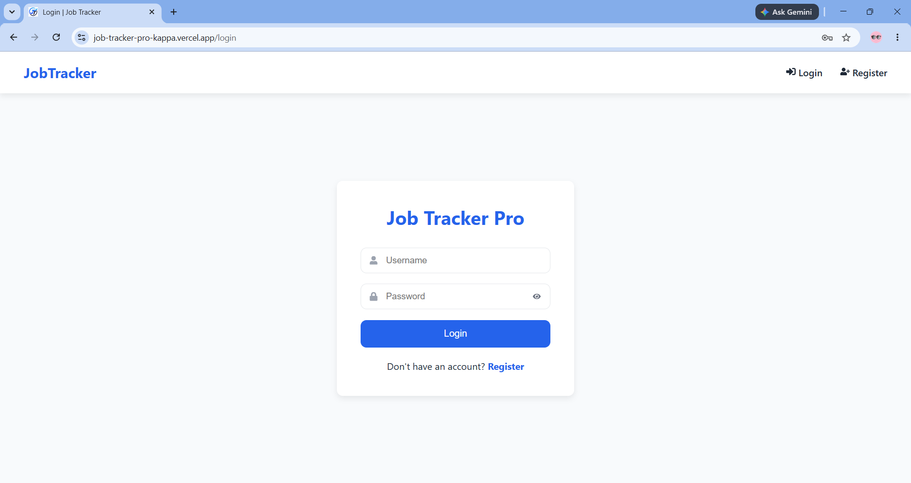
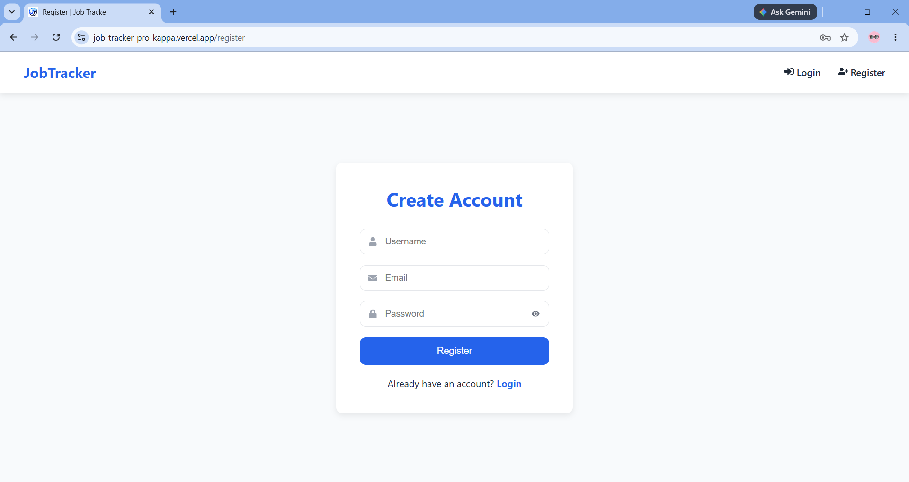
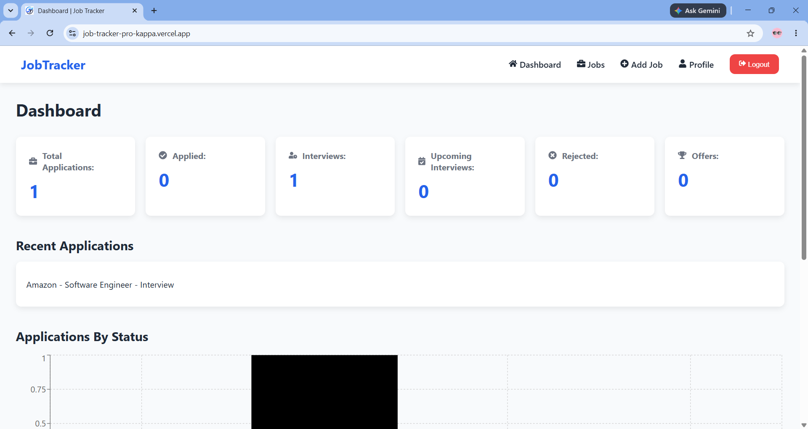
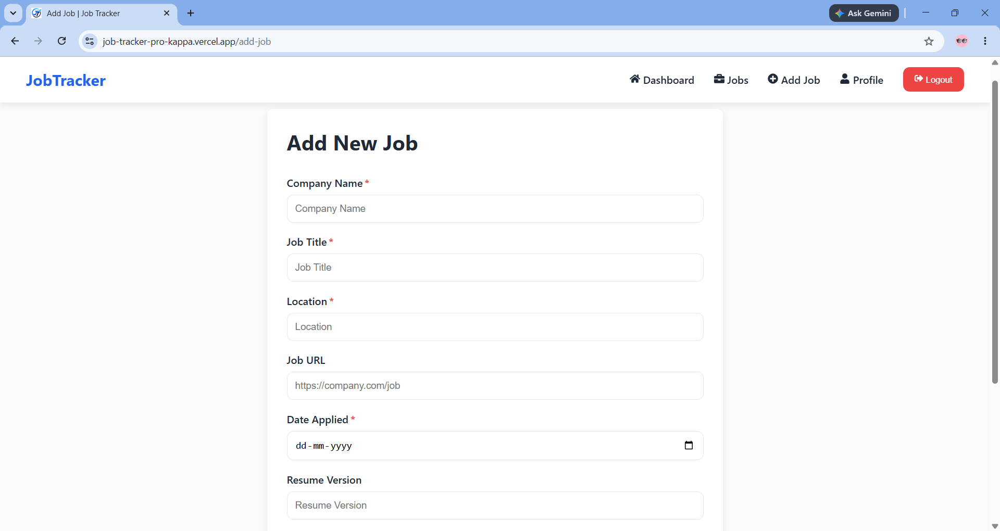
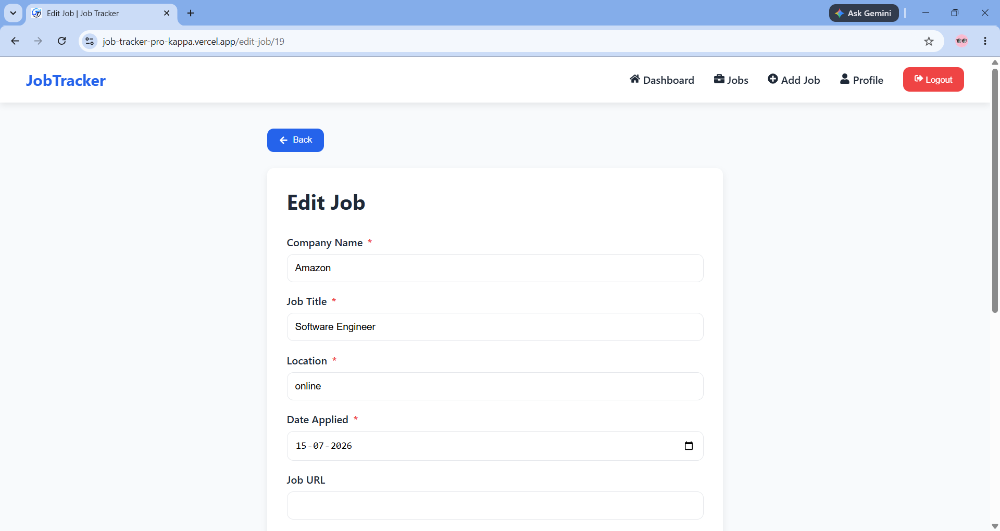
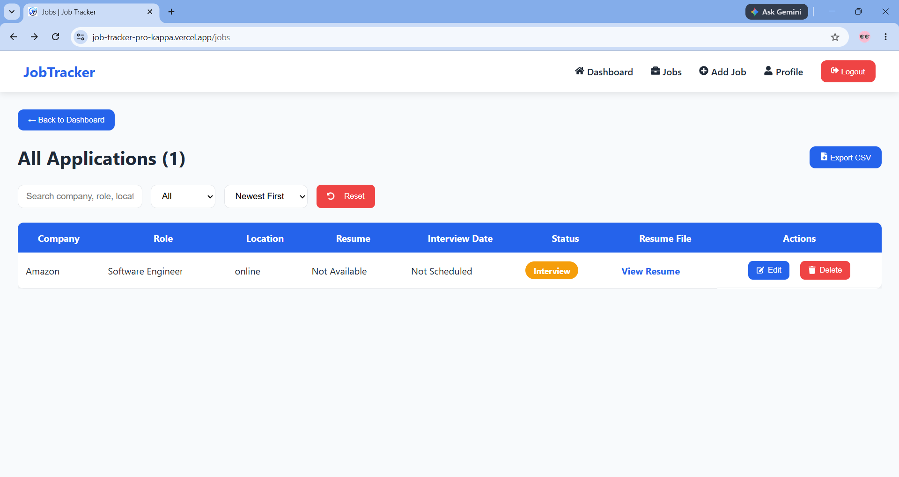

# 🚀 Job Tracker Pro

<p align="center">
  <b>A Full-Stack Job Application Tracking System built with React, Django REST Framework, and PostgreSQL.</b>
  <br><br>
  Track applications • Manage interviews • Upload resumes • Analyze progress
</p>

---

## 🌐 Live Demo

### Frontend
👉 https://YOUR-VERCEL-URL.vercel.app

### Backend API
👉 https://YOUR-RENDER-URL.onrender.com

---

## 📌 Overview

Job Tracker Pro is a modern web application designed to help job seekers organize and manage their job search efficiently.

The application allows users to securely manage job applications, upload resumes, monitor interview schedules, analyze application statistics, and keep all job-related information in one place.

---

# ✨ Features

### 🔐 Authentication
- User Registration
- Secure Login
- JWT Authentication
- Protected Routes
- Token Refresh Support

### 💼 Job Management
- Add Job Applications
- Edit Job Details
- Delete Applications
- View Complete Job History
- Update Application Stat

### 📄 Resume Management
- Upload Resume (PDF)
- Replace Existing Resume
- View Resume Online
- Automatic Resume Deletion when Updated
- Automatic Resume Deletion when Job is Removed
- Secure Cloud Storage using Supabase

### 📊 Dashboard
- Total Applications
- Applied Jobs
- Interview Count
- Upcoming Interviews
- Rejected Jobs
- Offers Received
- Recent Applications

### 🔍 Search & Filter
- Search by Company Name
- Search by Job Title
- Filter Applications by Status

### 📈 Analytics
- Application Statistics
- Status Summary
- Recent Applications

### 🎨 UI Features
- Responsive Design
- Mobile Friendly
- Loading Spinner
- Toast Notifications
- Custom Favicon
- Dynamic Browser Titles
- Clean Modern UI

---

# 🏗️ System Architecture

```text
                React Frontend (Vercel)
                        │
                        │ REST API
                        ▼
      Django REST Framework Backend (Render)
                        │
          ┌─────────────┴─────────────┐
          │                           │
          ▼                           ▼
   PostgreSQL Database         Supabase Storage
      (Job Details)            (Resume PDFs)
```
---

# 🛠 Tech Stack

## Frontend
- React.js
- React Router DOM
- Axios
- React Icons
- React Toastify
- CSS3

## Backend
- Python
- Django
- Django REST Framework
- Simple JWT Authentication

## Database
- PostgreSQL

## Cloud Storage
- Supabase Storage

## Deployment
- Vercel (Frontend)
- Render (Backend)

## Version Control
- Git
- GitHub

---

# 📂 Project Structure

```
Job-Tracker-Pro
│
├── frontend
│   ├── public
│   ├── src
│   │   ├── components
│   │   ├── pages
│   │   ├── services
│   │   ├── styles
│   │   └── assets
│   └── package.json
│
├── backend
│   ├── config
│   ├── jobs
│   ├── media
│   ├── requirements.txt
│   └── manage.py
│
└── README.md
```

---

# ⚙ Installation

## Clone Repository

```bash
git clone https://github.com/BellamGuruSrikar/Job-Tracker-Pro.git

cd Job-Tracker-Pro
```

---

## Backend Setup

```bash
cd backend

python -m venv venv

# Windows
venv\Scripts\activate

# Linux / Mac
source venv/bin/activate

pip install -r requirements.txt

python manage.py migrate

python manage.py runserver
```

Backend will run on:

```
http://127.0.0.1:8000/
```

---

## Frontend Setup

```bash
cd frontend

npm install

npm run dev
```

Frontend will run on:

```
http://localhost:5173/
```

---

# 🔑 Environment Variables

## Backend (.env)

```env
DJANGO_SECRET_KEY=your_secret_key

DEBUG=True

DATABASE_URL=your_database_url

ALLOWED_HOSTS=127.0.0.1,localhost

SUPABASE_URL=https://uwezxokmldmxogbtsceb.supabase.co

SUPABASE_SERVICE_KEY=your_service_role_key (use you own Key)

SUPABASE_BUCKET=resumes
```

---

## Frontend (.env)

```env
VITE_API_URL=http://127.0.0.1:8000/api
```

---

# 📡 API Endpoints

| Method | Endpoint | Description |
|---------|----------|-------------|
| POST | `/api/register/` | Register User |
| POST | `/api/token/` | Login |
| POST | `/api/token/refresh/` | Refresh Token |
| GET | `/api/jobs/` | Get Jobs |
| POST | `/api/jobs/` | Create Job |
| GET | `/api/jobs/{id}/` | Get Single Job |
| PUT | `/api/jobs/{id}/` | Update Job |
| DELETE | `/api/jobs/{id}/` | Delete Job |

---

# 📸 Screenshots

## Login Page


---

## Register


---

## Dashboard


---

## Add Job


---

## Edit Job


---

## Job List


---

# 🎥 Demo Video: https://www.linkedin.com/posts/bellam-guru-srikar-701a82248_opentowork-softwareengineer-fullstackdeveloper-ugcPost-7483349807818919936-XTiQ/?utm_source=share&utm_medium=member_desktop&rcm=ACoAAD1iEXEBNFq61TJveuIoPqWzbzaKgM3yJIQ

---

# 🚀 Production Features

- JWT Authentication
- Protected REST APIs
- PostgreSQL Database
- Secure Resume Storage
- Resume Replacement
- Automatic Resume Cleanup
- Responsive UI
- Production Deployment
- Environment Variable Configuration
- CORS Enabled

---

# 🚀 Future Improvements

- Email Notifications
- Calendar Integration
- Interview Reminders
- Resume Version History
- AI Resume Analyzer
- Interview Reminders
- Dark Mode
- Company Insights
- Job Recommendation System
- Export Jobs to Excel/PDF

---

# 👨‍💻 Author

**Bellam Guru Srikar**

🎓 B.Tech – Computer Science Engineering (AI & DS)

📧 Email: srikarsri2004@gmail.com

💻 GitHub:
https://github.com/BellamGuruSrikar

💼 LinkedIn:
https://www.linkedin.com/in/bellam-guru-srikar-701a82248/

---

# ⭐ If you like this project...

If you found this project useful or interesting,

please consider giving it a ⭐ on GitHub.

It motivates me to build more open-source projects.

---

<p align="center">
Made with ❤️ using React, Django REST Framework & PostgreSQL
</p>
